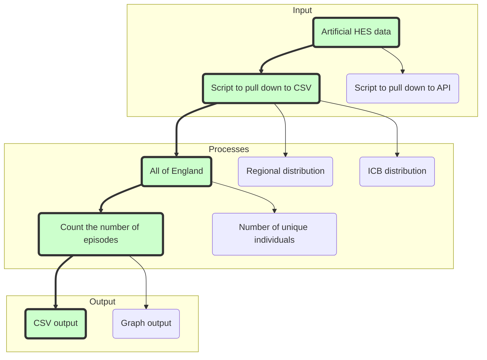

# RAP Example Pipeline - Python

:exclamation: Warning: this repository may contain references internal to NHS England that cannot be accessed publicly

This repo contains a simple example pipeline to act as an example of RAP good-practice with Python.

## Processes Flow-chart




## Contact
**This repository is maintained by [NHS England Data Science Team](datascience@nhs.net)**.
> _To contact us raise an issue on Github or via email._
> 
> See our (and our colleagues') other work here: [NHS England Analytical Services](https://github.com/NHSDigital/data-analytics-services)

## Description

[Reproducible Analytical Pipelines](https://nhsdigital.github.io/rap-community-of-practice/) can seem quite abstract - so this repo is meant to serve as a real example, that anyone can run, to see RAP in action.

The pipeline uses artificial HES data, which was chosen as it is "like" real data used in our industry, but also freely available. 

This example pipeline uses Apache Spark, which will be installed locally in your environment when you go through the "Getting Started" steps below.

The pipeline follows three steps which are common to almost all analytical pipelines:

1. Getting the data - in this case we download the artificial HES data as a CSV which is saved into folder called 'data_in' on your machine (see the code in src/data_ingestion)
2. Processing the data - the data is aggregated using Spark's python API, PySpark (the code for this is in src/processing)
3. Saving the processed data - the processed data is saved as a csv in a folder called 'data_out' (see the code in src/data_exports)

## Prerequisites

This code requires Python (> 3.0), the official Python website has [instructions for downloading and installing python](https://wiki.python.org/moin/BeginnersGuide/Download).

## Getting Started

1. Clone the repository. To learn about what this means, and how to use Git, see the [Git guide](https://nhsdigital.github.io/rap-community-of-practice/training_resources/git/using-git-collaboratively/).

```
git clone https://github.com/NHSDigital/RAP_example_pipeline_python
```

2. Set up your environment, _either_ using [pip](https://pypi.org/project/pip/) or [conda](https://www.anaconda.com/). For more information on how to use virtual environments and why they are important,. see the [virtual environments guide](https://nhsdigital.github.io/rap-community-of-practice/training_resources/python/virtual-environments/why-use-virtual-environments/).

### Using pip

If you're using Windows, enter the following commands into the Command Line or Powershell:

```
python -m venv .venv
.\.venv\Scripts\Activate.ps1
python -m pip install -r requirements.txt
```

If you're using Linux or MacOS, enter the following commands into the Terminal:

```
python -m venv .venv
source venv/bin/activate
python -m pip install -r requirements.txt
```

For Visual Studio Code it is necessary that you change your default interpreter to the virtual environment you just created .venv. To do this use the shortcut Ctrl-Shift-P, search for Python: Select interpreter and select .venv from the list.

## Using GitHub codespaces

If you are using GitHub Codespaces, the above installation steps will be completed automatically, so you don't need to do anything! 

Click the "Code" button above, click the "Codespaces" tab, and then click the "+" button to create a new codespace. The environment may take a minute or two to build when you load it for the first time.

## Running the pipeline
Before running the pipeline, make sure you are in the same folder as the `create-publication.py` file by entering the following command into the terminal:
`cd RAP_example_pipeline_python`

To run the pipeline, enter the following command into the terminal:
`python create_publication.py`

## Project structure

> Provide the user with an outline of your repository structure. This template is primarily designed for publications teams at NHS England. Projects with different requirements (e.g. more complex documentation and modelling) should look to [DrivenData's cookiecutter project structure](https://drivendata.github.io/cookiecutter-data-science/#directory-structure), as well as our [Community of Practice](https://nhsdigital.github.io/rap-community-of-practice/training_resources/python/project-structure-and-packaging/) for guidance.

```text
|   .gitignore                        <- Files (& file types) automatically removed from version control for security purposes
|   config.toml                       <- Configuration file with parameters we want to be able to change (e.g. date)
|   environment.yml                   <- Conda equivalent of requirements file
|   requirements.txt                  <- Requirements for reproducing the analysis environment 
|   pyproject.toml                    <- Configuration file containing package build information
|   LICENCE                           <- License info for public distribution
|   README.md                         <- Quick start guide / explanation of your project
|
|   create_publication.py             <- Runs the overall pipeline to produce the publication     
|
+---data_in                           <- Stores imported data that will be used to create the outputs
|   |       .gitkeep                  <- Empty file that enables the data_in folder to be committed
+---data_out                          <- Outputs and aggregations created by the pipeline are stored here
|   |       .gitkeep                  <- Empty file that enables the data_in folder to be committed
+---src                               <- Scripts with functions for use in 'create_publication.py'. Contains project's codebase.
|   |       __init__.py               <- Makes the functions folder an importable Python module
|   |
|   +---utils                         <- Scripts relating to configuration and handling data connections e.g. importing data, writing to a database etc.
|   |       __init__.py               <- Makes the functions folder an importable Python module
|   |       file_paths.py             <- Configures file paths for the package
|   |       logging_config.py         <- Configures logging
|   |       spark.py                  <- For setting up and configuring Apache Spark
|   | 
|   +---processing                    <- Scripts with modules containing functions to process data i.e. clean and derive new fields
|   |       __init__.py               <- Makes the functions folder an importable Python module
|   |       clean.py                  <- Perform cleaning and wrangling processes 
|   |       aggregate_counts.py       <- Creates aggregations and counts based on the imported data
|   | 
|   +---data_ingestion                <- Scripts with modules containing functions to preprocess read data i.e. perform validation/data quality checks, other preprocessing etc.
|   |       __init__.py               <- Makes the functions folder an importable Python module
|   |       get_data.py               <- Imports data and saves it to the data_in folder
|   |       preprocessing.py          <- Perform preprocessing, for example preparing your data for metadata or data quality checks.
|   |       validation_checks.py      <- Perform validation checks e.g. a field has acceptable values.
|   |       reading_data.py           <- Reads the imported and validated data into a spark dataframe ready for processing
|   |
|   +---data_exports
|   |       __init__.py               <- Makes the functions folder an importable Python module
|   |       write_excel.py            <- Populates an excel .xlsx template with values from your CSV output.
|   |       write_csv.py              <- Save outputs in CSV format to the data_out folder
|   |
+---sql                               <- SQL scripts for importing data  
|       example.sql
|
+---templates                         <- Templates for output files
|       publication_template.xlsx
|
+---tests
|   |       __init__.py               <- Makes the functions folder an importable Python module
|   |
|   +---backtests                     <- Comparison tests for the old and new pipeline's outputs
|   |       backtesting_params.py
|   |       test_compare_outputs.py
|   |       __init__.py               <- Makes the functions folder an importable Python module
|   |
|   +---unittests                     <- Tests for the functional outputs of Python code
|   |       test_data_connections.py
|   |       test_processing.py
|   |       __init__.py               <- Makes the functions folder an importable Python module
```

### `root`

In the highest level of this repository (known as the 'root'), there is one Python file: `create_publication.py`. This top level file should be the main place where users interact with the code, where you store the steps to create your publication.

This file currently runs a set of example steps using example data.

### `src`

This directory contains the meaty parts of the code. By organising the code into logical sections, we make it easier to understand, maintain and test. Moreover, tucking the complex code out of the way means that users don't need to understand everything about the code all at once.

* `data_ingestion/get_data.py` handles reading data in
* `processing` folder contains the core business logic.
* `utils` folder contains useful reusable functions (e.g. to set up logging, and importing configuration settings from `config.toml`)
* `write_csv.py` contains functions relating to the final part of the pipeline, where the aggregated figures are saved as CSV files in the data_out folder

-----------

## Licence

This codebase is released under the MIT License. This covers both the codebase and any sample code in the documentation.

Any HTML or Markdown documentation is [© Crown copyright](https://www.nationalarchives.gov.uk/information-management/re-using-public-sector-information/uk-government-licensing-framework/crown-copyright/) and available under the terms of the [Open Government 3.0 licence](https://www.nationalarchives.gov.uk/doc/open-government-licence/version/3/).

## Acknowledgements
- [Connor Quinn](https://github.com/connor1q)
- [Sam Hollings](https://github.com/SamHollings)
- [Maakhe Ndhlela](https://github.com/maakhe)
- [Harriet Sands](https://github.com/harrietrs)
- [Xiyao Zhuang](https://github.com/xiyaozhuang)
- [Helen Richardson](https://github.com/helrich)
- [The RAP team](https://github.com/NHSDigital/rap-community-of-practice)!
